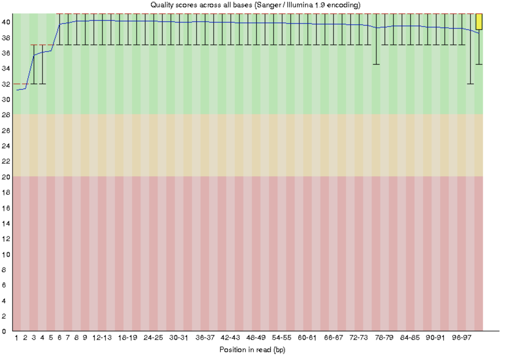
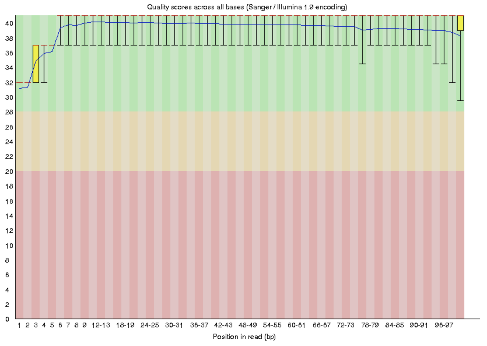

## Part 1 | SF-Seq read quality score distributions

Kohl    10_2G_both      17_3E_fox

The demultiplexed .fastq files are here: /projects/bgmp/2017_sequencing/demultiplexed/

1. *Using FastQC on Talapas, produce plots of quality score distributions for forward and reverse reads. Also, produce plots of the per-base N content, and comment on whether or not they are consistent with the quality score plots.*

### FastQC output

#### 10_2G_both_R1




#### 10_2G_both_R2


#### 17_3E_fox_R1




#### 17_3E_fox_R2


2. *Run your quality score plotting script from the index hopping assignment. Describe how the FastQC quality score distribution plots compare to your own. If different, propose an explanation. Also, does the runtime differ? If so, why?*


```{r}
R1_10_2G = read.delim("/Users/kohl/Documents/GradSchool/semester2/GenomicsLab/Assignments/sf-seq-qaa-kohlkopf/Part_1/q1.out", header = TRUE, sep = "\t")
R2_10_2G = read.delim("/Users/kohl/Documents/GradSchool/semester2/GenomicsLab/Assignments/sf-seq-qaa-kohlkopf/Part_1/q2.out", header = TRUE, "\t")
R1_17_3E = read.delim("/Users/kohl/Documents/GradSchool/semester2/GenomicsLab/Assignments/sf-seq-qaa-kohlkopf/Part_1/q3.out", header = TRUE, sep = "\t")
R2_17_3E = read.delim("/Users/kohl/Documents/GradSchool/semester2/GenomicsLab/Assignments/sf-seq-qaa-kohlkopf/Part_1/q4.out", header = TRUE, sep = "\t")
```

```{r}
plot(R1_10_2G$BPPosition, 
     R1_10_2G$MeanScore,
     type="n",
     ylim = range(0, 45),
     main = "10_2G_both R1 Read Quality",
     ylab = "Quality Score",
     xlab = "Base Position",
     xaxt = "n")
rect(-4, -4, 104, 20, col = rgb(222, 177, 178, 100, maxColorValue = 255), border = NA)
rect(-4, 20, 104, 28, col = rgb(228, 214, 178, 100, maxColorValue = 255), border = NA)
rect(-4, 28, 104, 48, col = rgb(183, 224, 178, 100, maxColorValue = 255), border = NA)
grid(NULL, 0)
arrows(R1_10_2G$BPPosition, 
       R1_10_2G$MeanScore-R1_10_2G$StDev, 
       R1_10_2G$BPPosition, 
       R1_10_2G$MeanScore+R1_10_2G$StDev, 
       length=0.01, 
       angle=90, 
       code=3)
lines(R1_10_2G$BPPosition, R1_10_2G$MeanScore)
axis(1, xaxp=c(0, 100, 20), las=2)
```

```{r}
plot(R2_10_2G$BPPosition, 
     R2_10_2G$MeanScore, 
     type="n",
     ylim = range(0, 45),
     main = "10_2G_both R2 Read Quality",
     ylab = "Quality Score",
     xlab = "Base Position",
     xaxt = "n")
rect(-4, -4, 104, 20, col = rgb(222, 177, 178, 100, maxColorValue = 255), border = NA)
rect(-4, 20, 104, 28, col = rgb(228, 214, 178, 100, maxColorValue = 255), border = NA)
rect(-4, 28, 104, 48, col = rgb(183, 224, 178, 100, maxColorValue = 255), border = NA)
grid(NULL, 0)
arrows(R2_10_2G$BPPosition, 
       R2_10_2G$MeanScore-R2_10_2G$StDev, 
       R2_10_2G$BPPosition, 
       R2_10_2G$MeanScore+R2_10_2G$StDev, 
       length=0.01, 
       angle=90, 
       code=3)
lines(R2_10_2G$BPPosition, R2_10_2G$MeanScore)
axis(1, xaxp=c(0, 100, 20), las=2)
```

```{r}
plot(R1_17_3E$BPPosition, 
     R1_17_3E$MeanScore,
     type="n",
     ylim = range(0, 45),
     main = "17_3E_fox R1 Read Quality",
     ylab = "Quality Score",
     xlab = "Base Position",
     xaxt = "n")
rect(-4, -4, 104, 20, col = rgb(222, 177, 178, 100, maxColorValue = 255), border = NA)
rect(-4, 20, 104, 28, col = rgb(228, 214, 178, 100, maxColorValue = 255), border = NA)
rect(-4, 28, 104, 48, col = rgb(183, 224, 178, 100, maxColorValue = 255), border = NA)
grid(NULL, 0)
arrows(R1_17_3E$BPPosition, 
       R1_17_3E$MeanScore-R1_17_3E$StDev, 
       R1_17_3E$BPPosition, 
       R1_17_3E$MeanScore+R1_17_3E$StDev, 
       length=0.01, 
       angle=90, 
       code=3)
lines(R1_17_3E$BPPosition, R1_17_3E$MeanScore)
axis(1, xaxp=c(0, 100, 20), las=2)
```

```{r}
plot(R2_17_3E$BPPosition, 
     R2_17_3E$MeanScore,
     type="n",
     ylim = range(0, 45),
     main = "17_3E_fox R2 Read Quality",
     ylab = "Quality Score",
     xlab = "Base Position",
     xaxt = "n")
rect(-4, -4, 104, 20, col = rgb(222, 177, 178, 100, maxColorValue = 255), border = NA)
rect(-4, 20, 104, 28, col = rgb(228, 214, 178, 100, maxColorValue = 255), border = NA)
rect(-4, 28, 104, 48, col = rgb(183, 224, 178, 100, maxColorValue = 255), border = NA)
grid(NULL, 0)
arrows(R2_17_3E$BPPosition, 
       R2_17_3E$MeanScore-R2_17_3E$StDev, 
       R2_17_3E$BPPosition, 
       R2_17_3E$MeanScore+R2_17_3E$StDev, 
       length=0.01, 
       angle=90, 
       code=3)
lines(R2_17_3E$BPPosition, R2_17_3E$MeanScore)
axis(1, xaxp=c(0, 100, 20), las=2)
```


## Part 2 | Adaptor trimming comparison

3. *Look into the adaptor trimming options for ```cutadapt```, ```process_shortreads```, and ```Trimmomatic``` (all on Talapas), and briefly describe the differences. Pick one of these to properly trim adapter sequences. Use default settings. What proportion of reads (both forward and reverse) was trimmed?* *Sanity check: Use your Unix skills to search for the adapter sequences in your datasets and confirm the expected sequence orientations.*
    + **cutadapt:** cutadapt removes adapter sequences from high-throughput sequencing reads. Replace "ADAPTER" with the actual sequence of your 3' adapter. IUPAC wildcard characters are supported. The reverse complement is *not* automatically searched. All reads from input.fastq will be written to output.fastq with the adapter sequence removed. Adapter matching is error-tolerant. Multiple adapter sequences can be given (use further -a options), but only the best-matching adapter will be removed. 
    + **process_shortreads:** process_shortreads is part of the Stacks program. 
    + **Trimmomatic:** trimmomatic is a program written in java. A particular strength of Trimmomatic is that it retains the pairing of reads. It provides four output files when trimming paired end reads: trimmed paired and unpaired for both forward and reverse reads.
    
### Trimmomatic
#### Commands

Run trimmomatic on Talapas. Specify inputs, outputs, phred33, and the file with the adapter sequences. Remove leading low quality or N bases (below quality 3) (LEADING:3), remove trailing low quality or N bases (below quality 3) (TRAILING:3), scan the read with a 4-base wide sliding window, cutting when the average quality per base drops below 15 (SLIDINGWINDOW:4:15), and drop reads below the 36 bases long (MINLEN:36). Perform the trimming for 10_2G_both and 17_3E_fox.

##### 10_2G_both
```{.bash}
$ java -jar $EBROOTTRIMMOMATIC/trimmomatic-0.36.jar PE ../10_2G_both_S8_L008_R1_001.fastq ../10_2G_both_S8_L008_R2_001.fastq ../out_paired_10_2G_both_S8_L008_R1_001.fastq ../out_unpaired_10_2G_both_S8_L008_R1_001.fastq ../out_paired_10_2G_both_S8_L008_R2_001.fastq ../out_unpaired_10_2G_both_S8_L008_R2_001.fastq -phred33 ILLUMINACLIP:TruSeq3-PE.fa:2:30:10 LEADING:3 TRAILING:3 SLIDINGWINDOW:4:15 MINLEN:36
```
##### 17_3E_fox
```{.bash}
$ java -jar $EBROOTTRIMMOMATIC/trimmomatic-0.36.jar PE ../17_3E_fox_S13_L008_R1_001.fastq ../17_3E_fox_S13_L008_R2_001.fastq ../out_paired_17_3E_fox_S13_L008_R1_001.fastq ../out_unpaired_17_3E_fox_S13_L008_R1_001.fastq ../out_paired_17_3E_fox_S13_L008_R2_001.fastq ../out_unpaired_17_3E_fox_S13_L008_R2_001.fastq -phred33 ILLUMINACLIP:TruSeq3-PE.fa:2:30:10 LEADING:3 TRAILING:3 SLIDINGWINDOW:4:15 MINLEN:36
```

#### Results

Trimmomatic stats reported. In addition to this information, four output files were created for 10_2G_both and four output files were created for 17_3E_fox.

##### 10_2G_both
```{.bash}
Using PrefixPair: 'AGATCGGAAGAGCACACGTCTGAACTCCAGTCAC' and 'AGATCGGAAGAGCGTCGTGTAGGGAAAGAGTGT'
ILLUMINACLIP: Using 1 prefix pairs, 0 forward/reverse sequences, 0 forward only sequences, 0 reverse only sequences
Input Read Pairs: 81477069 Both Surviving: 75244573 (92.35%) Forward Only Surviving: 5957979 (7.31%) Reverse Only Surviving: 152833 (0.19%) Dropped: 121684 (0.15%)
```
##### 17_3E_fox
```{.bash}
Using PrefixPair: 'AGATCGGAAGAGCACACGTCTGAACTCCAGTCAC' and 'AGATCGGAAGAGCGTCGTGTAGGGAAAGAGTGT'
ILLUMINACLIP: Using 1 prefix pairs, 0 forward/reverse sequences, 0 forward only sequences, 0 reverse only sequences
Input Read Pairs: 11784410 Both Surviving: 11034285 (93.63%) Forward Only Surviving: 708449 (6.01%) Reverse Only Surviving: 25910 (0.22%) Dropped: 15766 (0.13%)
TrimmomaticPE: Completed successfully
```


  
4. *Plot the trimmed read length distributions for both forward and reverse reads (on the same plot). If necessary, consult Assignment 5 (Block 1) from Bi 623 to refresh your memory.*

Return a list of read lengths for 10_2G_R1, 10_2G_R2, 17_3E_R1, and 17_3E_R2.

```{..bash}
$ awk 'NR % 4 == 2' out_paired_10_2G_both_S8_L008_R1_001.fastq | awk '{print length}' |sort | uniq -c > 10_2G_R1_lengths.txt
$ awk 'NR % 4 == 2' out_paired_10_2G_both_S8_L008_R2_001.fastq | awk '{print length}' |sort | uniq -c > 10_2G_R2_lengths.txt

$ awk 'NR % 4 == 2' out_paired_17_3E_fox_S13_L008_R1_001.fastq  | awk '{print length}' |sort | uniq -c > 17_3E_R1_lengths.txt
$ awk 'NR % 4 == 2' out_paired_17_3E_fox_S13_L008_R2_001.fastq  | awk '{print length}' |sort | uniq -c > 17_3E_R2_lengths.txt
```

```{r}
trimmed_len_R1_10_2G = read.table("/Users/kohl/Documents/GradSchool/semester2/GenomicsLab/Assignments/sf-seq-qaa-kohlkopf/Part_2/10_2G_R1_lengths.txt")
trimmed_len_R2_10_2G = read.table("/Users/kohl/Documents/GradSchool/semester2/GenomicsLab/Assignments/sf-seq-qaa-kohlkopf/Part_2/10_2G_R2_lengths.txt")

trimmed_len_R1_17_3E = read.table("/Users/kohl/Documents/GradSchool/semester2/GenomicsLab/Assignments/sf-seq-qaa-kohlkopf/Part_2/17_3E_R1_lengths.txt")
trimmed_len_R2_17_3E = read.table("/Users/kohl/Documents/GradSchool/semester2/GenomicsLab/Assignments/sf-seq-qaa-kohlkopf/Part_2/17_3E_R2_lengths.txt")
```

```{r}
colnames(trimmed_len_R1_10_2G)[1:2] = c("counts", "lengths")
colnames(trimmed_len_R2_10_2G)[1:2] = c("counts", "lengths")

plot(trimmed_len_R1_10_2G$counts~trimmed_len_R1_10_2G$lengths, 
     log = "y", col = "red4", 
     pch = 3, xlab = "Read Lengths", 
     ylab = "log(Counts)", 
     main = "Adapter-Trimmed Sequence Length Distributions 10_2G_both")
points(trimmed_len_R2_10_2G$counts~trimmed_len_R2_10_2G$lengths, col = "blue4", pch = 5)
legend(35,60000000, 
       c("10_2G_both R1", "10_2G_both R2"), 
       pch=c(3,5), 
       col=c("red4", "blue4"))
```


```{r}
colnames(trimmed_len_R1_17_3E)[1:2] = c("counts", "lengths")
colnames(trimmed_len_R2_17_3E)[1:2] = c("counts", "lengths")

plot(trimmed_len_R1_17_3E$counts~trimmed_len_R1_17_3E$lengths, 
     log = "y", 
     col = "magenta4", 
     pch = 3, 
     xlab = "Read Lengths", 
     ylab = "log(Counts)",
     main = "Adapter-Trimmed Sequence Length Distributions 17_3E_fox")
points(trimmed_len_R2_17_3E$counts~trimmed_len_R2_17_3E$lengths, col = "green4", pch = 5)
legend(35,9000000, 
       c("17_3E_fox R1", "17_3E_fox R2"), 
       pch=c(3,5), 
       col=c("magenta4", "green4"))
```


5. *Briefly describe whether the adaptor trimming results are consistent with the insert size distributions for your libraries. The size distribution information is in the Fragment Analyzer trace file on Github.*
+ The adapter trimming results are consistent witht he insert size distribution information produced by the fragment analyzer.

## Part 3 | rRNA reads and strand-specificity

6. *Find publicly available mouse rRNA sequences and generate a gsnap database from them. Align the SF-Seq reads to your mouse rRNA database and report the proportion of reads that likely came from rRNAs.*

Retrieve ncRNA data for *Mus musculus* from ensembl.
```{.bash}
$ ftp ftp://ftp.ensembl.org/pub/release-90/fasta/mus_musculus/ncrna/Mus_musculus.GRCm38.ncrna.fa.gz ./
```

Utilizing UNIX commands manipulate the data to get rid of newline characters and pull out only rRNA.
```{.bash}
$ awk '!/^>/ { printf "%s", $0; n = "\n" } /^>/ { print n $0; n = "" } END { printf "%s", n } ' Mus_musculus.GRCm38.ncrna.fa > results.txt

$ grep -A 1 "rRNA" results.txt > mus_rRNA_seqs.fa
```

Build a gmap database of the *Mus musculus* rRNA. Align 10_2G_both_R1 to the database. Align 17_3E_R1 to the database.
```{.bash}
$ gmap_build -D Mouse -d mouse_rRNA -k 15 mus_rRNA_seqs.fa

$ gsnap -D Mouse -d mouse_rRNA -B 4 -m 20 -t 8 -O --split-output aligned_10_2G -A sam ../Trim/out_paired_10_2G_both_S8_L008_R1_001.fastq
$ gsnap -D Mouse -d mouse_rRNA -B 4 -m 20 -t 8 -O --split-output aligned_17_3E -A sam ../Trim/out_paired_17_3E_fox_S13_L008_R1_001.fastq
```

Utilizing UNIX commands, generate counts of rRNA reads.
```{.bash}
$ grep -Po "K.+:\w+:\w+:\w:\w+:\w+:\w+" aligned_10_2G.unpaired* | sort | uniq -c | wc -l
260236
$ grep -Po "K.+:\w+:\w+:\w:\w+:\w+:\w+" aligned_10_2G.nomapping | sort | uniq -c | wc -l
74984337
```
`r 260236/(260236+74984337) ` of the reads in the 10_2G_both sample likely came from rRNAs.

```{.bash}
$ grep -Po "K.+:\w+:\w+:\w:\w+:\w+:\w+" aligned_17_3E.unpaired* | sort | uniq -c | wc -l
446591
$ grep -Po "K.+:\w+:\w+:\w:\w+:\w+:\w+" aligned_17_3E.nomapping | sort | uniq -c | wc -l
10587694
```
`r 446591/(446591+10587694) ` of the reads in the 17_3E_fox sample likely came from rRNAs.


7. *Demonstrate convincingly that the SF-Seq data are from “strand-specific” RNA-Seq libraries. There are a number of possible strategies to address this problem, but you need only implement one. Report your evidence in numeric and graphical (e.g. a plot) forms.*


Count the occurences continuous sequences of As and Ts of varying lengths (15-101) for each file.
```{.bash}
# 10_2G_both
$ egrep -oh "A{15,101}" out_paired_10_2G_both_S8_L008_R1_001.fastq out_unpaired_10_2G_both_S8_L008_R1_001.fastq | sort | uniq -c > 10_2G_R1_A.txt

$ egrep -oh "T{15,101}" out_paired_10_2G_both_S8_L008_R1_001.fastq out_unpaired_10_2G_both_S8_L008_R1_001.fastq | sort | uniq -c > 10_2G_R1_T.txt

$ egrep -oh "A{15,101}" out_paired_10_2G_both_S8_L008_R2_001.fastq out_unpaired_10_2G_both_S8_L008_R2_001.fastq | sort | uniq -c > 10_2G_R2_A.txt

$ egrep -oh "T{15,101}" out_paired_10_2G_both_S8_L008_R2_001.fastq out_unpaired_10_2G_both_S8_L008_R2_001.fastq | sort | uniq -c > 10_2G_R2_T.txt

# 17_3E_fox
$ egrep -oh "A{15,101}" out_paired_17_3E_fox_S13_L008_R1_001.fastq out_unpaired_17_3E_fox_S13_L008_R1_001.fastq | sort | uniq -c > 17_3E_R1_A.txt

$ egrep -oh "T{15,101}" out_paired_17_3E_fox_S13_L008_R1_001.fastq out_unpaired_17_3E_fox_S13_L008_R1_001.fastq | sort | uniq -c > 17_3E_R1_T.txt

$ egrep -oh "A{15,101}" out_paired_17_3E_fox_S13_L008_R2_001.fastq out_unpaired_17_3E_fox_S13_L008_R2_001.fastq | sort | uniq -c > 17_3E_R2_A.txt

$ egrep -oh "T{15,101}" out_paired_17_3E_fox_S13_L008_R2_001.fastq out_unpaired_17_3E_fox_S13_L008_R2_001.fastq | sort | uniq -c > 17_3E_R2_T.txt
```

```{r}
R1_10_2G_A = read.table("/Users/kohl/Documents/GradSchool/semester2/GenomicsLab/Assignments/sf-seq-qaa-kohlkopf/Part_3/10_2G_R1_A.txt", header = F)

R1_10_2G_T = read.table("/Users/kohl/Documents/GradSchool/semester2/GenomicsLab/Assignments/sf-seq-qaa-kohlkopf/Part_3/10_2G_R1_T.txt", header = F)

R2_10_2G_A = read.table("/Users/kohl/Documents/GradSchool/semester2/GenomicsLab/Assignments/sf-seq-qaa-kohlkopf/Part_3/10_2G_R2_A.txt", header = F)

R2_10_2G_T = read.table("/Users/kohl/Documents/GradSchool/semester2/GenomicsLab/Assignments/sf-seq-qaa-kohlkopf/Part_3/10_2G_R2_T.txt", header = F)
```

```{r}
R1_17_3E_A = read.table("/Users/kohl/Documents/GradSchool/semester2/GenomicsLab/Assignments/sf-seq-qaa-kohlkopf/Part_3/17_3E_R1_A.txt", header = F)

R1_17_3E_T = read.table("/Users/kohl/Documents/GradSchool/semester2/GenomicsLab/Assignments/sf-seq-qaa-kohlkopf/Part_3/17_3E_R1_T.txt", header = F)

R2_17_3E_A = read.table("/Users/kohl/Documents/GradSchool/semester2/GenomicsLab/Assignments/sf-seq-qaa-kohlkopf/Part_3/17_3E_R2_A.txt", header = F)

R2_17_3E_T = read.table("/Users/kohl/Documents/GradSchool/semester2/GenomicsLab/Assignments/sf-seq-qaa-kohlkopf/Part_3/17_3E_R2_T.txt", header = F)
```

Get lengths of the continous As or Ts.
```{r}
R1_10_2G_A$tail_len = lapply(as.character(R1_10_2G_A$V2), nchar)
R1_10_2G_T$tail_len = lapply(as.character(R1_10_2G_T$V2), nchar)
R2_10_2G_A$tail_len = lapply(as.character(R2_10_2G_A$V2), nchar)
R2_10_2G_T$tail_len = lapply(as.character(R2_10_2G_T$V2), nchar)

R1_17_3E_A$tail_len = lapply(as.character(R1_17_3E_A$V2), nchar)
R1_17_3E_T$tail_len = lapply(as.character(R1_17_3E_T$V2), nchar)
R2_17_3E_A$tail_len = lapply(as.character(R2_17_3E_A$V2), nchar)
R2_17_3E_T$tail_len = lapply(as.character(R2_17_3E_T$V2), nchar)
```


```{r}
plot(R1_10_2G_A$tail_len,
     R1_10_2G_A$V1,
     log = "y",
     col = "blue",
     type = "l", 
     ylab = "Counts",
     xlab = "Number of As or Ts",
     main = "Occurences of PolyA Tails, Strand Specificity Implied")

lines(R1_10_2G_T$tail_len, R1_10_2G_T$V1, type = "l", col = "purple")
lines(R2_10_2G_A$tail_len, R2_10_2G_A$V1, type = "l", col = "green4")
lines(R2_10_2G_T$tail_len, R2_10_2G_T$V1, type = "l", col = "yellow4")

legend(15,40, 
       c("R1_10_2G A", "R1_10_2G T", "R2_10_2G A", "R2_10_2G T"), 
       lty=c(1,1,1,1), 
       lwd=c(2.5,2.5,2.5,2.5),
       col=c("blue", "purple", "green4", "yellow4"))
```

```{r}
plot(R1_17_3E_A$tail_len,
     R1_17_3E_A$V1,
     log = "y",
     col = "blue",
     type = "l", 
     ylab = "Counts",
     xlab = "Number of As or Ts",
     main = "Occurences of PolyA Tails, Strand Specificity Implied")

lines(R1_17_3E_T$tail_len, R1_17_3E_T$V1, type = "l", col = "purple")
lines(R2_17_3E_A$tail_len, R2_17_3E_A$V1, type = "l", col = "green4")
lines(R2_17_3E_T$tail_len, R2_17_3E_T$V1, type = "l", col = "yellow4")

legend(77,6000, c("R1_17_3E A", "R1_17_3E T", "R2_17_3E A", "R2_17_3E T"), lty=c(1,1,1,1), lwd=c(2.5,2.5,2.5,2.5),col=c("blue", "purple", "green4", "yellow4"))


```


